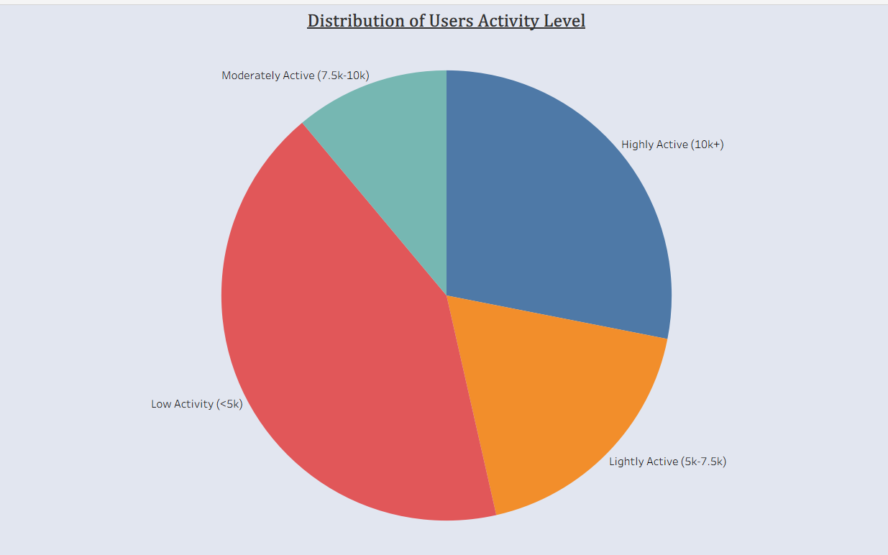
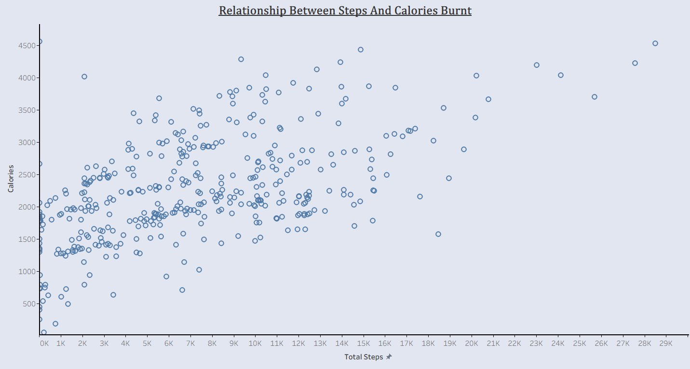
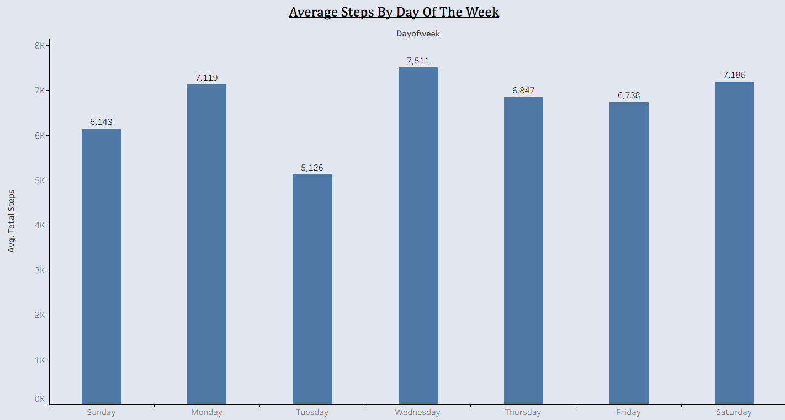
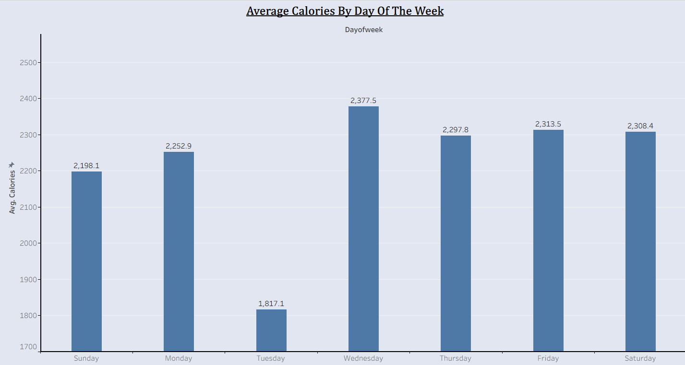
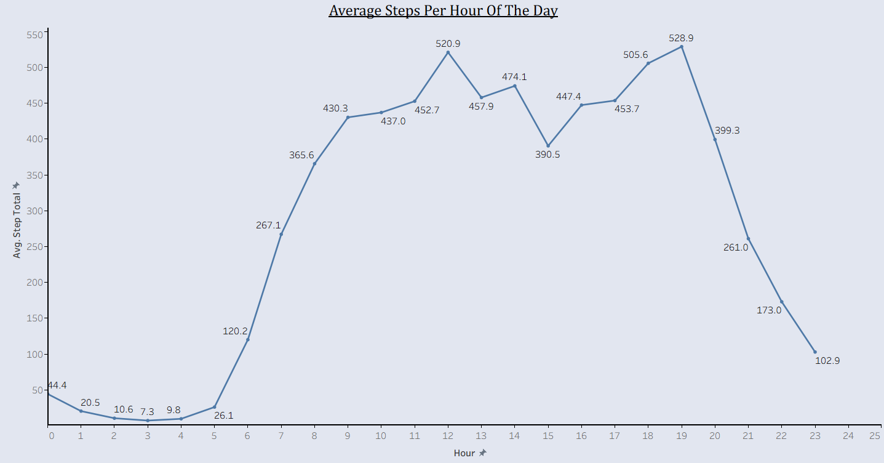
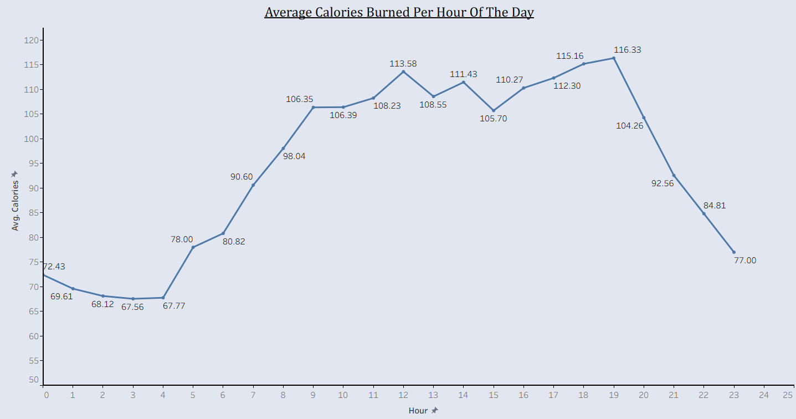
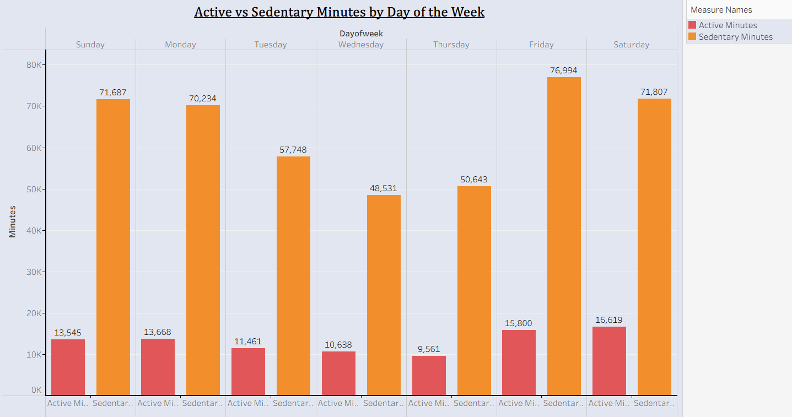
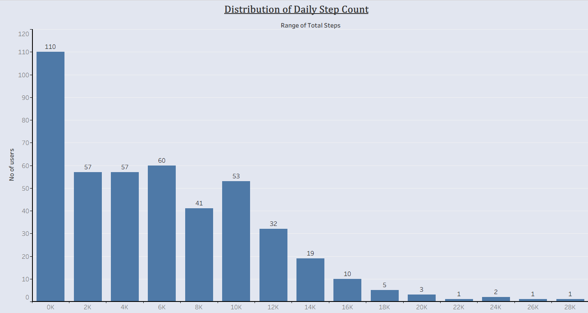

# BELLABEAT CASE STUDY

**Google Data Analytics Professional Certificate Capstone Project**

**Author: Zaina Khanum**

### Business Task Summary

**About the company**: Bellabeat is a high-tech manufacturer of beautifully designed smart health products targeted specifically at women.

**Business Objective**:  
Bellabeat aims to become a major player in the global smart device market. To achieve this, the marketing team wants to leverage consumer smart device usage data to uncover meaningful behavioral trends. These insights will help refine product features and shape more effective, data-driven marketing strategies.

**Key Guiding Questions**:
- What are the current trends in smart device usage?
- How can these trends be applied to Bellabeat’s existing and potential customers?
- What high-level recommendations can be made to influence Bellabeat’s marketing strategy?

**Role**: As a Junior Data Analyst on the Bellabeat marketing team, this analysis focuses on transforming raw Fitbit usage data into actionable marketing intelligence.

### Data Sources

The analysis was conducted using the **Fitbit Fitness Tracker Data** publicly available on [Kaggle](https://www.kaggle.com/datasets/arashnic/fitbit).

**Dataset Details:**
- **Time Period**: March 12 – May 12, 2016 (split into two export folders)
- **Sample Size**: 30 eligible Fitbit users who consented to share their data
- **Data Type**: Daily, hourly, and minute-level activity, sleep, and weight logs

**Main Files Used:**
- `dailyActivity_merged.csv` — Primary file (steps, distance, calories, active minutes)
- `hourlySteps_merged.csv` — For hourly activity patterns
- `hourlyCalories_merged.csv` — For Calorie tracking

**Note**: The dataset is from 2016 and represents a small sample of Fitbit users. Limitations include potential sampling bias and short observation period.

## Data Cleaning & Manipulation

**Tools Used**: Microsoft Excel, Tableau

**Cleaning Steps:**
- Checked and removed duplicate rows (none found)
- Formatted `ActivityDate` column as proper Date type
- Removed invalid records where `TotalSteps = 0` and `Calories = 0` (5 rows removed — days device was not worn)
- Created two new calculated columns:
  - `DayOfWeek` using formula: `=TEXT(ActivityDate, "dddd")`
  - `TotalActiveMinutes` using formula: `=SUM(VeryActiveMinutes, FairlyActiveMinutes, LightlyActiveMinutes)`

Cleaned data was then imported into **Tableau Public** for analysis and visualization.

## Summary of the Analysis

The analysis explored user behavior patterns using daily, hourly, and aggregated activity data. Key areas examined include daily and hourly activity levels, sedentary behavior, correlation between steps and calories, and user activity segmentation.

1) **Distribution of Users Activity Level**

    The majority of users fall into the Low Activity (<5k steps) and Lightly Active (5k-7.5k steps) categories.
  
    

2) **Relationship Between Steps and Calories**

   There is a strong positive correlation: the more steps users take, the more calories they burn.

   

3) **Average Steps by Day of Week**
   
    Users are most active on weekends, with Saturday and Sunday showing the highest average steps. Activity is lowest mid-week.

    

4) **Average Calories Burned by Day of Week**
   
    Calories burned follow a similar pattern to steps, peaking on weekends and being relatively consistent throughout the week.

    

5) **Average Steps Per Hour of the Day**
   
    Activity is lowest in the early morning and peaks in the evening hours (around 7 PM – 8 PM).

    

6) **Average Calories Burned Per Hour of the Day**
   
   Calories burned follow a similar hourly pattern, with peaks in the evening.

   

7) **Active vs Sedentary Minutes by Day of the Week**

    Users spend significantly more time being sedentary than active on every day of the week.

    

8) **Distribution of Daily Step Count**

    Most days have step counts between 0 to 8,000 steps, with very few days exceeding 12,000 steps.

    

## Strategic Recommendations for Growth 

Based on the analysis, here are the top recommendations for Bellabeat’s marketing and product strategy:

- *Focus on Weekend Engagement*

  Since users are most active on Saturdays and Sundays, Bellabeat should run targeted marketing campaigns and challenges during weekends to capitalize on higher motivation levels.

- *Promote Movement Reminders* 

  With high sedentary time observed every day, Bellabeat can emphasize features that send smart notifications to encourage users to move after long periods of inactivity.

- *Encourage Progressive Step Goals*

  Most users fall into Low to Lightly Active categories. Bellabeat can introduce personalized, gradual step goals (e.g., starting from 5k–7.5k and building up to 10k+) to improve user retention and satisfaction.

- *Evening-Focused Features*

  Since activity peaks in the evening hours, the Bellabeat app could send motivational messages or workout suggestions between 5 PM and 8 PM.

- *Holistic Wellness Approach*

  Highlight the integration of activity tracking with sleep and stress monitoring, as users show interest in overall wellness rather than steps alone.

## Conclusion
This analysis of Fitbit smart device data provided valuable insights into user behavior patterns, activity levels, and opportunities for Bellabeat. The findings highlight that users are generally low to moderately active, spend a large portion of their day sedentary, and show higher engagement during weekends and evening hours.
By leveraging these insights, Bellabeat can develop more targeted marketing strategies, improve product features, and better meet the wellness needs of its female customers.
The project successfully demonstrated the end-to-end data analysis process - from data cleaning and exploration to visualization and recommendation - as part of the Google Data Analytics Professional Certificate Capstone.

***Author: Zaina Khanum***
